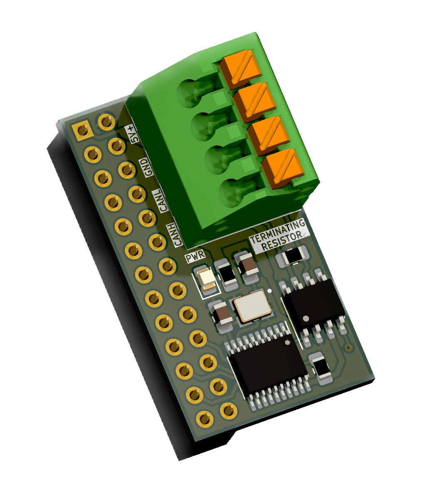
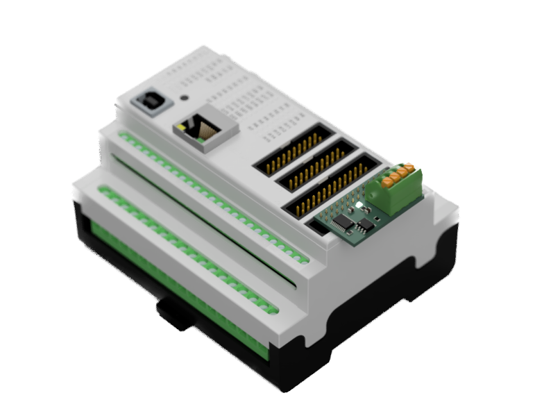

# Controllino-CAN
Small PCB that fits onto the header of a [Controllino-MEGA](https://www.controllino.com/product/controllino-mega/) allowing it to interface with CAN devices through a SPI interface. Does not take up any output/input pins!

<p float="left" align="center">
   
  
</p>

## Example Code
Utilises the [MCP2515 arduino library](https://github.com/autowp/arduino-mcp2515). See futher information in the [examples folder](https://github.com/HarveyBates/controllino-can/tree/main/examples).

```cpp
#include <Controllino.h>
#include "mcp2515.h"

#define BIT_RATE CAN_500KBPS
#define NODE_ID 0x0A // Node-ID = 10
#define FUNCTION_CODE 0x180 // CANopen PDO1_TX

// Setup MCP2515 lib with SPI chip-select pin
MCP2515 can(CONTROLLINO_PIN_HEADER_SS);

void setup() {
  Serial.begin(115200);
  Controllino_RTC_init();
  can.reset();
  can.setBitrate(BIT_RATE, MCP_8MHZ);
  can.setNormalMode();
}

void loop() {
  can_frame frame{};
  frame.can_dlc = 8;
  frame.can_id = FUNCTION_CODE | NODE_ID;
  if (can.sendMessage(&frame) == MCP2515::ERROR_OK) {
    Serial.println("TX");
  } else {
    Serial.println("ERR");
  }
  delay(5000);
}
```

## BOM
The bill-of-materials can be found [here](https://github.com/HarveyBates/controllino-can/blob/main/bom/controllino-can-digikey.csv). **The componets only cost $12 AUD ($8 USD).**

## PCB ordering
Compress the [gerber folder](https://github.com/HarveyBates/controllino-can/tree/main/electronics/gerber) and upload to your PCB manufactuer of choice (e.g. [jlcpcb]([https://jlcpcb.com/](https://cart.jlcpcb.com/quote/)https://cart.jlcpcb.com/quote/) or [PCBway](https://www.pcbway.com/) etc.). As the components are SMD (0805 smallest size) get a stencil (top-side of PCB only) to make assembly easier. **PCB plus stencil is roughly $15 AUD ($10 USD).**

## Licence
Controllino-CAN is licenced under the GNU General Public Licence v3.0 as outlined in the [LICENCE](https://github.com/HarveyBates/controllino-can/blob/main/LICENSE).
